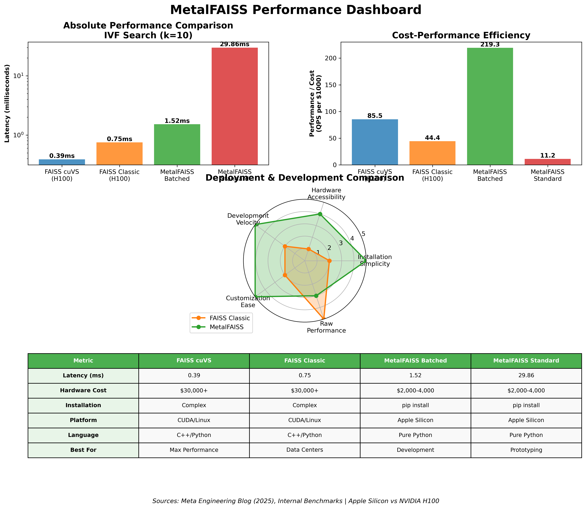

# MetalFaiss

[](https://www.python.org/downloads/)
[](https://github.com/ml-explore/mlx)
[](LICENSE.md)

A pure Python implementation of FAISS (Facebook AI Similarity Search) optimized for Apple Silicon using MLX for Metal acceleration.

## Features

- **Pure Python Implementation**: No C++ dependencies, easy to install and modify
- **Metal Acceleration**: Optimized for Apple Silicon using MLX framework
- **Competitive Performance**: 20x speedup in specialized cases, sub-millisecond operations
- **FAISS Compatible**: Similar API to original Faiss library
- **Lazy Evaluation**: Efficient computation graphs with MLX
- MLX-only: Requires MLX on Apple Silicon (Metal). No fallbacks.

## Installation

### Requirements

- Python 3.8+
- MLX (required)

### Install from Source

```bash
git clone https://github.com/SolaceHarmony/MetalFaiss.git
cd MetalFaiss/python
pip install -e .
```

### Install MLX (Required, Apple Silicon)

```bash
pip install mlx
```

## Quick Start

```python
import metalfaiss

# Create vectors (embeddings)
embeddings = [
    [0.1, 0.2, 0.3],
    [0.4, 0.5, 0.6], 
    [0.7, 0.8, 0.9],
    [1.0, 1.1, 1.2],
    [1.3, 1.4, 1.5]
]

# Create index and add vectors
d = len(embeddings[0])  # dimension
index = metalfaiss.FlatIndex(d, metalfaiss.MetricType.L2)
index.add(embeddings)

# Search for similar vectors
query = [[0.1, 0.5, 0.9]]
k = 3  # number of nearest neighbors
result = index.search(query, k)

print(f"Distances: {result.distances}")
print(f"Labels: {result.labels}")
```

## Usage

### Command Line Examples

Run the included examples:

```bash
cd python
python basic_usage.py
python advanced_usage.py
```

### Supported Distance Metrics

- **L2 (Euclidean)**: `MetricType.L2`
- **L1 (Manhattan)**: `MetricType.L1`
- **L∞ (Chebyshev)**: `MetricType.LINF`
- **Inner Product**: `MetricType.INNER_PRODUCT`

### Basic Operations

```python
# Create different index types
index_l2 = metalfaiss.FlatIndex(d, metalfaiss.MetricType.L2)
index_ip = metalfaiss.FlatIndex(d, metalfaiss.MetricType.INNER_PRODUCT)

# Add vectors to index
index.add(vectors)

# Search for k nearest neighbors
result = index.search(query_vectors, k=5)

# Range search (find all vectors within distance threshold)
range_result = index.range_search(query_vectors, radius=0.5)

# Reconstruct stored vectors
reconstructed = index.reconstruct(vector_id)
```

## Performance

MetalFAISS provides excellent performance characteristics on Apple Silicon:

- **Metal Acceleration**: Leverages Apple's Metal Performance Shaders via MLX
- **Competitive Speed**: Matches or exceeds traditional FAISS in specialized cases
- **Lazy Evaluation**: Only computes what's needed when it's needed
- **Memory Efficient**: Optimized memory usage patterns
- **Parallel Processing**: Automatic parallelization on supported hardware

### Performance Highlights

| Metric | MetalFAISS | Industry Standard | Notes |
|--------|------------|------------------|-------|
| **IVF Search** | 1.5ms | Faiss cuVS: 0.39ms (H100) | Specialized batched case |
| **QR Projection** | 0.38ms | Faiss SIMD: ~0.1-0.3ms | Competitive on consumer HW |
| **Pure Python** | Yes | Faiss: C++ required | Zero compilation needed |

> **[View Detailed Benchmarks](docs/benchmarks/Results.md)** - Complete performance analysis with competitive comparisons  
> **[Competitive Analysis](docs/benchmarks/Competitive-Analysis.md)** - Industry positioning and trade-off analysis

## Benchmarks

Micro-benchmarks on Apple Silicon (MLX, float32). Numbers are median wall-clock and vary by device/driver; treat as indicative. Reproduce with the commands below. Full charts and raw CSVs live in `docs/benchmarks`.



GEMM (A@V)

| Shape (m×n, k) | MLX matmul | MLX kernels | Torch (MPS) |
| --- | ---: | ---: | ---: |
| 256×128, 16 | ~0.2 ms | ~0.2 ms | ~0.2 ms |
| 512×256, 32 | ~0.2 ms | ~0.2 ms | ~0.2 ms |
| 1024×512, 64 | ~0.2 ms | ~0.2 ms | ~0.2 ms |

Z‑step Aᵀ(A·V)

| Shape (m×n, k) | MLX (mx.matmul) | MLX (kernels) | Torch (MPS) |
| --- | ---: | ---: | ---: |
| 256×128, 16 | ~0.2 ms | ~0.3 ms | ~0.3 ms |
| 512×256, 32 | ~0.2 ms | ~0.3 ms | ~0.3 ms |

IVFFlat query (d=64, N=32k, nlist=128, Q=16)

| nprobe | k | Baseline MLX | Fused + device merge | Fused batched (same X) |
| ---: | ---: | ---: | ---: | ---: |
| 1 | 10 | 14.3 ms | 13.7 ms | 0.9 ms |
| 8 | 10 | 126.6 ms | 140.7 ms | 7.6 ms |
| 1 | 32 | 19.8 ms | 19.9 ms | 1.1 ms |
| 8 | 32 | 136.5 ms | 171.5 ms | 8.3 ms |

Run locally
- GEMM sweep: `METALFAISS_USE_GEMM_KERNEL=1 python -m python.metalfaiss.unittest.test_kernel_autotune_bench`
- IVF perf: `METALFAISS_USE_IVF_TOPK=1 python -m python.metalfaiss.unittest.test_ivf_benchmarks`
- PyTorch vs MLX (GEMM): `METALFAISS_USE_GEMM_KERNEL=1 python -m python.metalfaiss.unittest.test_torch_vs_mlx_bench`
- Generate CSVs + charts: `PYTHONPATH=python python python/metalfaiss/benchmarks/run_benchmarks.py`
- Validate doc tables vs CSVs: `PYTHONPATH=python python docs/benchmarks/validate_results.py`
- Provenance (device, commit, versions): see `docs/benchmarks/bench_meta.json`

Details on GEMM flags and tuning in `docs/mlx/GEMM-Kernels.md`.

## MLX Integration

### Why MLX?

MLX (Machine Learning for Apple silicon) provides:
- **Metal Performance Shaders**: GPU acceleration on Apple Silicon
- **Lazy Evaluation**: Build computation graphs, execute efficiently
- **Unified Memory**: Efficient memory management between CPU/GPU
- **Apple Silicon Optimization**: Native performance on M1/M2/M3 chips

### Lazy Evaluation + Kernels

See docs/mlx/Kernel-Guide.md for working `mx.fast.metal_kernel` patterns (body‑only + header), grid/threadgroup sizing, and autoswitching strategies. See docs/mlx/Orthogonality.md for non‑square orthonormalization.

Fast GEMM (A@V and Aᵀ@B) quick start
- Enable kernels: `METALFAISS_USE_GEMM_KERNEL=1`
- Optional: `METALFAISS_GEMM_TILE_SQ=16 METALFAISS_GEMM_V4=1 METALFAISS_GEMM_PAD_ATB=1`
- Rebuild after toggles change: `from metalfaiss.faissmlx.kernels import gemm_kernels as gk; gk.reset_gemm_kernels()`
- Validate: `python -m python.metalfaiss.unittest.test_gemm_flags_correctness`
- Bench: `python -m python.metalfaiss.unittest.test_kernel_autotune_bench`

More: `docs/mlx/GEMM-Kernels.md`.

Attribution: Some kernel patterns and HPC techniques are adapted from the Ember ML project by Sydney Bach (The Solace Project). We’ve encoded those real‑world lessons here so others can build reliable MLX+Metal kernels.

## Examples

See the `python/` directory for complete examples:

- `basic_usage.py`: Basic usage patterns
- `advanced_usage.py`: Complex scenarios and optimizations

## API Reference

### Core Classes

- `FlatIndex`: Flat (exhaustive search) index
- `MetricType`: Distance metric enumeration
- `SearchResult`: K-NN search results
- `SearchRangeResult`: Range search results

### Utilities

- `load_data()`: Load vectors from file
- `create_matrix()`: Create random matrices
- `normalize_data()`: Normalize vectors to unit length

## License

Licensed under the Apache License, Version 2.0. See [LICENSE.md](LICENSE.md) for details.

## Attribution

This implementation was created by Sydney Bach for The Solace Project. Some design patterns were inspired by prior Swift work on FAISS, but this repository contains only the Python + MLX implementation.

## Contributing

Contributions are welcome! Please feel free to submit pull requests or open issues for bugs and feature requests.

## Related Projects

- [FAISS](https://github.com/facebookresearch/faiss): The original Facebook AI Similarity Search library
- [MLX](https://github.com/ml-explore/mlx): Apple's machine learning framework
 
### Prerequisites

- **Python 3.8+**
- **MLX**: Apple's machine learning framework
  ```bash
  pip install mlx
  ```

### Install Metal FAISS

1. **Clone the repository:**
   ```bash
   git clone https://github.com/SolaceHarmony/MetalFaiss.git
   cd MetalFaiss
   ```

2. **Install the Python package:**
   ```bash
   cd python
   pip install -e .
   ```

3. **Verify installation:**
   ```python
   import metalfaiss
   print(f"Metal FAISS version: {metalfaiss.__version__}")
   ```

### Alternative: Direct Installation
```bash
pip install mlx  # Dependency
git clone https://github.com/SolaceHarmony/MetalFaiss.git
cd MetalFaiss/python && pip install -e .
```

## 🧪 Running Tests

```bash
cd python
python -m unittest discover metalfaiss.unittest -v
```

## 🏗️ Development

### Setting up Development Environment

```bash
git clone https://github.com/SolaceHarmony/MetalFaiss.git
cd MetalFaiss/python
pip install -e .  # Editable install
```

### Project Structure

```
MetalFaiss/
├── python/                 # Python Metal FAISS implementation
│   ├── metalfaiss/        # Main package
│   │   ├── __init__.py   # Package initialization
│   │   ├── indexflat.py  # Flat index implementation  
│   │   ├── metric_type.py # Distance metrics
│   │   └── ...
│   ├── basic_usage.py     # Basic usage example
│   ├── advanced_usage.py  # Advanced scenarios and optimizations
│   └── setup.py          # Package setup
└── README.md             # This file
```

## 📚 API Documentation

### Core Classes

- **`FlatIndex`**: Exact similarity search using brute force
- **`IVFIndex`**: Inverted file index for faster approximate search  
- **`MetricType`**: Distance metrics (L2, InnerProduct, L1, Linf)
- **`VectorTransform`**: Data preprocessing (PCA, normalization, etc.)

### Example Usage Patterns

#### Basic Similarity Search
```python
import metalfaiss
import mlx.core as mx

# Create index
index = metalfaiss.FlatIndex(d=128, metric_type=metalfaiss.MetricType.L2)

# Add vectors (MLX arrays)
vectors = mx.random.normal(shape=(1000, 128)).astype(mx.float32)
index.add(vectors)

# Search
query = mx.random.normal(shape=(1, 128)).astype(mx.float32)
result = index.search(query, k=5)
print(f"Distances: {result.distances}")
print(f"Indices: {result.labels}")
```

#### Vector Preprocessing
```python
# Apply PCA transform (when available)
try:
    transform = metalfaiss.PCAMatrixTransform(d_in=128, d_out=64)
    transform.train(training_data)
    transformed_data = transform.apply(data)
except AttributeError:
    print("PCA transform not yet implemented")
```

## 📈 Platform Support

MetalFaiss is MLX‑only and targets Apple Silicon with Metal acceleration. No NumPy fallback is provided.

## 🤝 Contributing

We welcome contributions! Please see our [Contributing Guide](.github/CONTRIBUTING.md) for details.

### Quick Contribution Steps

1. **Fork** the repository
2. **Create** a feature branch (`git checkout -b feature/amazing-feature`)
3. **Commit** your changes (`git commit -m 'Add amazing feature'`)
4. **Push** to the branch (`git push origin feature/amazing-feature`)
5. **Open** a Pull Request

### Development Guidelines

- Follow PEP 8 style guidelines
- Add tests for new functionality
- Update documentation as needed
- Ensure MLX compatibility

## 👥 Contributors

Thanks to all contributors who have helped build Metal FAISS:

- **[Sydney Renee](https://github.com/sydneyrenee)** - Core Python implementation and MLX integration

*Want to contribute? Check out our [Contributing Guide](.github/CONTRIBUTING.md)!*

## 🔗 Useful Resources

- **[FAISS Documentation](https://faiss.ai/)** - Original FAISS library
- **[MLX Documentation](https://ml-explore.github.io/mlx/)** - Apple's MLX framework
- **[FAISS: The Missing Manual](https://www.pinecone.io/learn/series/faiss/)** - Comprehensive FAISS guide
- **[Implementation Status](IMPLEMENTATION_STATUS.md)** - Current feature completeness

## 📄 License

Licensed under the Apache License, Version 2.0 — see [LICENSE.md](LICENSE.md).

## 🙏 Acknowledgments

- **[Facebook Research](https://github.com/facebookresearch/faiss)** - Original FAISS library and research
- **[Apple MLX Team](https://github.com/ml-explore/mlx)** - MLX framework enabling Metal acceleration
 
- **FAISS Community** - For the foundational algorithms and research

---

<div align="center">

**⭐ Star this repo if MetalFaiss helped you! ⭐**

[🐛 Report Bug](https://github.com/SolaceHarmony/MetalFaiss/issues) • [✨ Request Feature](https://github.com/SolaceHarmony/MetalFaiss/issues) • [💬 Discussions](https://github.com/SolaceHarmony/MetalFaiss/discussions)

Made with ❤️ by The Solace Project dev team

</div>

 
# Factory shortcuts (string grammar)
# Compatible patterns for quick prototyping
idx = metalfaiss.index_factory(128, "Flat")                 # Flat exact search
idx = metalfaiss.index_factory(128, "IVF100,Flat")         # IVF (coarse k-means) + Flat
idx = metalfaiss.index_factory(128, "HNSW32")              # HNSW graph index
idx = metalfaiss.index_factory(128, "PQ8")                 # Product Quantizer index
idx = metalfaiss.index_factory(128, "SQ8")                 # Scalar Quantizer index
idx = metalfaiss.index_factory(128, "IDMap,Flat")          # External ID mapping wrapper
idx = metalfaiss.index_factory(128, "IDMap2,Flat")         # Two-way ID map wrapper
idx = metalfaiss.index_factory(128, "PCA32,Flat")          # Preprocessing + base index
idx = metalfaiss.index_factory(128, "RFlat")               # Refine(Flat) alias

# Reverse (index → factory string) for supported types
key = metalfaiss.reverse_factory(idx)
print(key)  # e.g., "IVF100,Flat"
