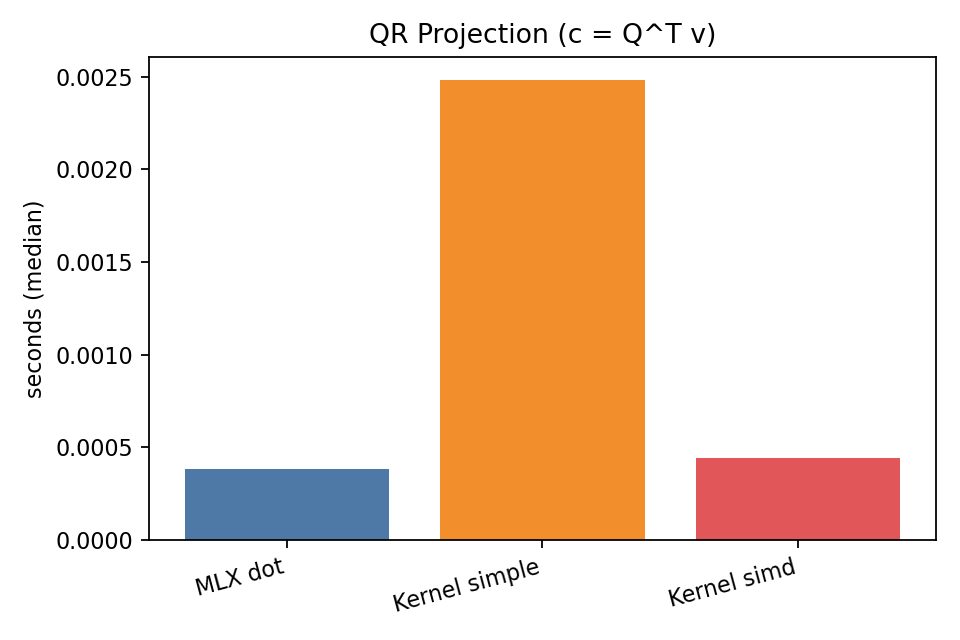
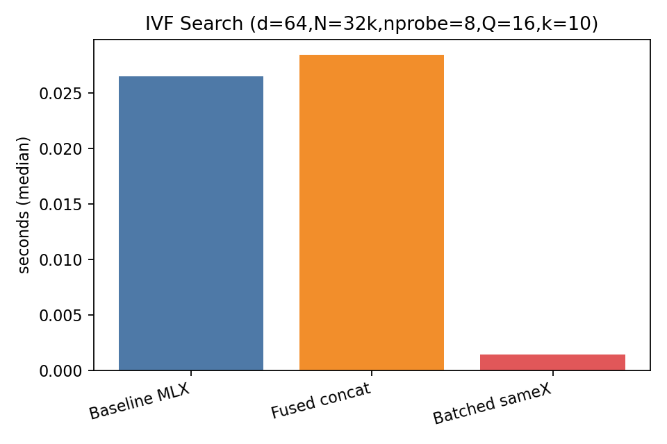

Benchmark Results (MLX + Metal)

This page summarizes median timings from our core benchmarks. See CSVs alongside the charts for raw values. To regenerate, run:

```
PYTHONPATH=python python python/metalfaiss/benchmarks/run_benchmarks.py
```

QR Projection (c = Qᵀv)



- MLX dot: baseline MLX matmul
- Kernel simple: per-thread loop
- Kernel simd: one warp per column (fastest)

IVF Search (d=64, N=32k, nprobe=8, Q=16, k=10)



- Baseline MLX: emulated argsort over concatenated probed lists
- Fused concat: single kernel computes distances + top‑k
- Batched sameX: synthetic case where queries share candidates (fastest)

Orthogonality (m=1024, n=256)


- orthonormal_columns: QR over X (Q has orthonormal columns)
- orthogonalize_blocked: blocked two‑pass MGS (often fastest)
- orthogonal_init: QR of square random, sliced (initializer)

Notes
- Charts are generated with matplotlib if available; otherwise only CSVs are written.
- Benchmarks use median of 5 runs with 1 warmup. Update shapes as needed in `run_benchmarks.py`.

