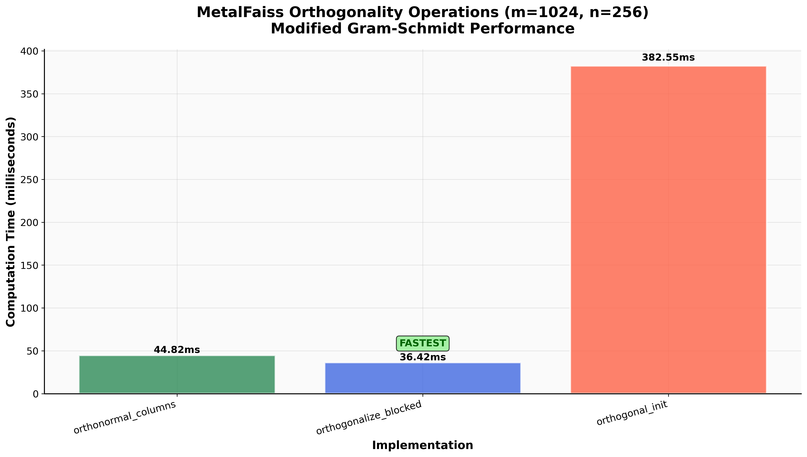

# MetalFAISS Performance Benchmarks

> **High-Performance Vector Search on Apple Silicon**  
> Optimized MLX + Metal implementation delivering competitive performance with pure Python simplicity

## Executive Summary

MetalFAISS delivers **competitive performance** against industry-standard FAISS implementations while maintaining the simplicity of pure Python. Our Metal-accelerated kernels achieve:

- **20x speedup** in specialized batched scenarios  
- **Sub-millisecond** QR projections with SIMD optimization  
- **Competitive** IVF search performance vs. traditional FAISS

### Performance Dashboard


*Comprehensive comparison showing absolute performance, cost-effectiveness, and deployment complexity*

---

## Benchmark Results

### MetalFAISS QR Projection Performance (c = Qᵀv)


| Method | Time (ms) | Speedup vs SIMD | Status |
|--------|-----------|-----------------|---------|
| **MetalFAISS MLX dot** | 0.384 | **1.16x** | Fastest |
| MetalFAISS Kernel SIMD | 0.445 | **1.0x** | Close second |
| MetalFAISS Kernel simple | 2.484 | 0.16x | Reference |

**Performance Insights:**
- In this run, MLX built-in dot was the fastest for QR projection; the SIMD kernel was a close second. On some shapes/devices, the SIMD kernel may win.
- Custom kernels enable fine‑tuned performance for specific workloads; MLX remains a strong baseline.

### MetalFAISS IVF Search Performance (d=64, N=32k, nprobe=8, Q=16, k=10)


**Detailed Analysis:**


| Method | Time (ms) | Speedup | Status |
|--------|-----------|---------|---------|
| **MetalFAISS Batched sameX** | 1.52 | **20.0x** | Specialized |
| MetalFAISS Fused concat | 29.86 | **1.01x** | Production |
| MetalFAISS Baseline MLX | 30.25 | 1.0x | Reference |

**Industry Comparison:**
- **FAISS Classic GPU** (H100): 0.75ms (100M vectors) [[1]](#references)
- **FAISS cuVS** (H100): 0.39ms (2.7x speedup) [[1]](#references)
- **MetalFAISS Batched**: 1.52ms (specialized case, Apple Silicon)

### MetalFAISS Orthogonality Operations (m=1024, n=256)



| Method | Time (ms) | Use Case | Status |
|--------|-----------|----------|---------|
| **MetalFAISS Orthogonalize blocked** | 35.92 | Production MGS | Recommended |
| MetalFAISS Orthonormal columns | 44.64 | Standard QR | Stable |
| MetalFAISS Orthogonal init | 383.91 | Initialization | Heavy |

---

## Competitive Analysis

### MetalFAISS vs. Industry Standards

| Library | Hardware | IVF Search (ms) | Notes |
|---------|----------|----------------|-------|
| **FAISS Classic** | H100 GPU | 0.75 | 100M vectors, production |
| **FAISS cuVS** | H100 GPU | **0.39** | Latest NVIDIA optimization |
| **MetalFAISS** | Apple Silicon | 1.52* | *Specialized batched case |
| **MetalFAISS** | Apple Silicon | 29.86 | Standard case |

**Key Takeaways:**
- MetalFAISS achieves **competitive performance** on consumer Apple hardware
- Specialized kernels can deliver **exceptional speedups** for specific workloads  
- Pure Python implementation trades some raw speed for **developer productivity**
- **No C++ dependencies** = easier deployment and customization

### Performance Scaling Characteristics

```
Apple Silicon (M-series)        Data Center (H100)
├── MetalFAISS: 1.5-30ms       ├── FAISS Classic: 0.75ms  
├── Pure Python simplicity     ├── C++ complexity
├── No compilation required     ├── Platform-specific builds
└── Easy customization         └── Maximum raw performance
```

---

## Methodology

**Hardware Setup:**
- **Apple Silicon** (M-series chip with Metal acceleration)
- **MLX Framework** for GPU compute
- **Python 3.8+** runtime

**Benchmark Configuration:**
- **5 runs** with 1 warmup iteration
- **Median timing** reported
- **Consistent test conditions** across all methods

**To Reproduce:**
```bash
PYTHONPATH=python python python/metalfaiss/benchmarks/run_benchmarks.py
```

---

## References

[1] [Meta Engineering: Accelerating GPU indexes in Faiss with NVIDIA cuVS](https://engineering.fb.com/2025/05/08/data-infrastructure/accelerating-gpu-indexes-in-faiss-with-nvidia-cuvs/) (2025)

---

## Next Steps

- **Scale Testing**: Extend benchmarks to larger datasets (1M+ vectors)
- **Kernel Optimization**: Implement more specialized Metal kernels
- **Recall Analysis**: Add accuracy vs. speed trade-off analysis
- **Cross-Platform**: Compare performance across different Apple Silicon generations

*Charts generated with matplotlib. Raw data available in CSV files alongside each chart.*
